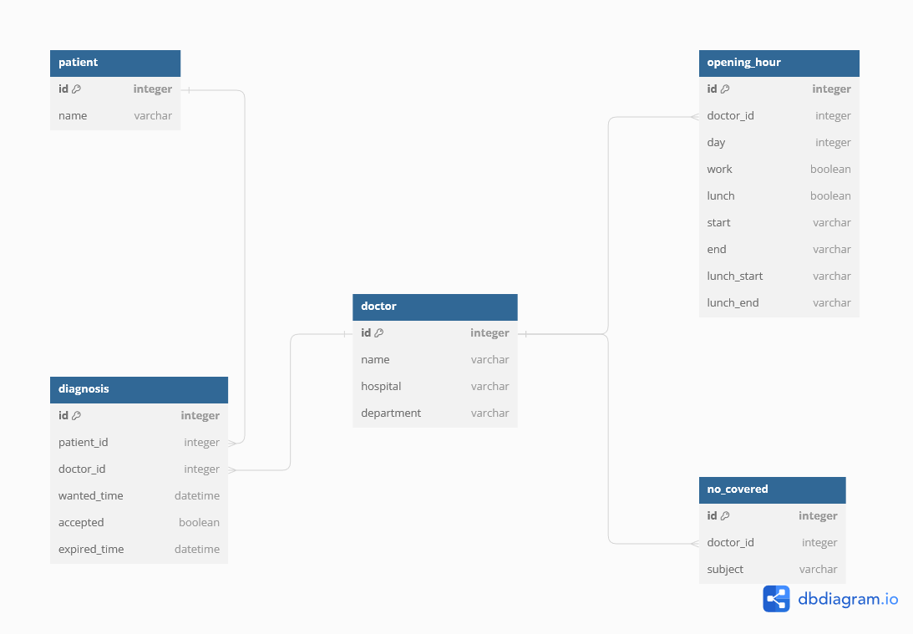

# 비대면 진료 예약 서비스의 백엔드 연습


## 프로젝트 세팅

### 목표

- 환자가 진료받고 싶은 의사나 진료 과목을 검색해 찾는 서비스
- 의사에게 환자가 예약신청을 하는 서비스
  - 의사 진료 시간과 예약시간을 비교해 진료 시간인지 판별
  - 상황에 따른 진료요청 만료 시간 설정
- 개별 의사에게 신청된 예약 내역 확인
- 의사가 이를 파악하고 신청 수락여부를 결정하는 서비스


### 프로젝트 초기 세팅

- venv 가상환경 세팅(requirements.txt에 저장)

  - 실행방법

    ```shell
    python venv venv
    source venv/Scripts/activate
    pip install -r requirements.txt
    
    python manage.py runserver (포트번호)
    #제 컴퓨터의 문제인지 확실하지 않으나 8000포트가 보안이슈로 막혀 다른 포트(8080)를 이용했습니다.
    ```

- **디렉토리 구조**
  - connect_hospital_patient
    - accounts
      - 진료 이외의 모델(환자/ 의사/ 영업시간/ 비급여항목)
        - 비급여항목의 경우/ 나만의 닥터의 구성을 참고해 분리
      - 의사/ 환자 등록 및 의사 검색 기능
    - diagnosis
      - 진료 모델
      - 진료 요청 등록/ 검색/ 수락

- 기술 스펙

  - Python / Django / Django Rest Framework(DRF)

- DB 구성

  


### 데이터 입력방법

- 모든 데이터는 json 형태로 통신합니다

```json
// 일반 고객(환자) 정보 등록 데이터
{
	"name": "홍길동"
}

// 의사 정보 등록 데이터
{
	"name": "홍민수",
	"hospital": "민수가정의원",
	"department": "가정의학과, 소아과, 피부과",
    "no_covered": [{
        			"subject": "다이어트약"
    			}, {
                    "subject": "안약"
                }, {
                    "subject": "소화제"
                }],
    "time": [{
        "day": 0, // 월요일: 0, 화요일: 1, ... 일요일: 6
        "work": 1, // 영업시 1, 휴무시 0
        "lunch": 1, // 점심시간이 있을 경우 1, 없을 경우 0
        "start": "0000", // 영업시작시간, 형식은 integer
        "end": "1800", // 영업종료시간
        "lunch_start": "1200", // 점심시작시간
        "lunch_end": "1300" // 점심종료시간
	    },..., {
        "day": 6, // 일요일: 6
        "work": 0, // 휴무 0
        "lunch": 0, // 점심시간이 없는 경우 0
        "start": "0000", // 휴일의 경유 모두 0000의 형태로
        "end": "0000",
        "lunch_start": "0000",
        "lunch_end": "0000"
	    }]
}

// 의사 검색 데이터
{
    "type": "string", // 문자열 검색은 string, 날짜 검색은 date
    "detail": "소아과 홍길동"// 문자열은 string 형식 그대로, 날짜 방식은 "YYYYMMDDHHmm"의 형태로
}

// 진료요청 데이터
{
    "patient": 1, // patient pk
    "doctor": 3, // doctor pk
    "datetime": "202311141200" // "YYYYMMDDHHmm"
}

// 진료요청 검색 데이터
{
    "doctor": 2 // doctor pk
}

// 진료요청 수락 데이터
{
    "diagnosis": 1 // diagnosis pk
}
```


### 로직 실행 방법

1. 일반 회원 등록

   json 형태의 request 데이터를 serializer를 통해 저장


2. 의사 회원 등록
   - 주어진 데이터를 받으면 우선 "time" 파트의 데이터들이 숫자로 구성되어있는지 판별한 후, doctor에 대한 serializer를 구성하고 저장.
   - 이후 doctor를 외래 키로 가지는 no_covered(비급여)와 opening_hour(영업 시간) serializer를 생성 후 저장.


3. 의사 검색

   - json의 "type"이 "string"일 경우

     - 검색 단어를 빈 칸을 기준으로 split해 list를 생성

     - list를 iteration하면서 전체 QuerySet에서 word들을 아무 column에서 가지고 있는 Query들만 filtering하는 작업들을 반복

       ```python
       words = detail.split()
       doctors = Doctor.objects
       for word in words:
             doctors = doctors.filter(Q(name__contains = word) | Q(hospital__contains = word) | Q(department__contains=word))
           serializer = DoctorShowSerializer(doctors, many=True)
       ```

     - 모든 word들을 검색하고 남은 QuerySet들을 serializer를 통해 반환

   - "type"이 "datetime"일 경우

     - 연, 월, 일, 시/분으로 시간 구분
     - 해당 날의 요일을 구한 후, 해당 요일의 시/분에 영업 중인 QuerySet를 구한 후, 이들을 union으로 통합
     - 통합된 QuerySet들을 serializer를 통해 반환


4. 진료 요청
   - 진료 요청 시간이 현재 시간보다 이전이라면, 400 error로 반환
   - 진료 요청 시간의 요일을 구하고, 해당 요일의 영업 시간과 진료 요청 시간 비교
   - 영업 시간 내라면 요청 만료 시간을 계산
     - 현재 시간이 영업 중이면 현재 기준으로 20분 후
     - 현재 점심시간일 경우, 점심 종료 시간 기준 15분 후
     - 영업 일이나, 아직 시작하지 않았을 경우, 영업 시작 시간 기준 15분 후
     - 이외의 경우, 다음 진료 요일의 영업 시작 시간 기준 15분 후
   - 영업 시간 외라면 "병원 진료시간이 아닙니다"라는 결과값 반환


5. 진료 요청 검색
   - 요청받은 doctor의 pk를 가지고 승인되지 않은 QuerySet를 serializer를 통해 반환


6. 진료 요청 수락
   - 이미 승인한 진료를 요청한 경우, 404 error를 통해 존재하지 않는(이미 승인한) 요청 사항이라 보냄
   - 요청한 진료의 데이터에서 승인을 True로 바꾼 update데이터를 덮어씌움
   - 정상적으로 작동했으면 serializer를 통해 해당 요청의 데이터를 반환


### 테스트

- Postman을 통한 Unit Test를 진행
- 이외에 django 내부의 test code를 만들어 실행하려 했으나, DB 충돌을 해결하지 못해 확인하지 못함
  - 단 postman을 이용한 테스트 방식과 동일한 방식을 하였기 때문에 실행에는 문제가 없을 것으로 판단
